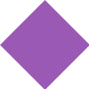

# 🎨 Shape CLI

> *"Every pixel tells a story, every shape has purpose."*

**Generate beautiful geometric shapes from your terminal in seconds.**

Shape CLI is a lightning-fast command-line tool that creates stunning PNG images of geometric shapes. Perfect for designers, developers, and anyone who needs clean, solid-color shapes for their projects.

<div align="center">


</div>

---

## ✨ What You Get

<p align="center">
  
  
  
  
  
  
  
  
  
  
  
  
  
</p>

**13 Perfect Shapes** • **Any Size** • **Any Color** • **Zero Dependencies**

---

## 🚀 Quick Start

```bash
# Install and run in one command
bunx @iamkaf/shape circle 100 100 "#ff6b6b"
```

**That's it!** You just created a beautiful red circle. No installation required.

<div align="center">
  
</div>

---

## 🎯 Perfect For

- **🎨 Designers** - Quick mockups and placeholder graphics
- **💻 Developers** - UI testing and rapid prototyping  
- **📚 Content Creators** - Social media graphics and illustrations
- **🔧 Automation** - CI/CD pipelines and batch processing
- **🎮 Game Development** - Simple sprites and assets

---

## 🔥 Features That Make You Faster

### 🧠 Smart & Forgiving
```bash
# Typos? No problem!
bunx @iamkaf/shape circl 100 100 blue     # → circle
bunx @iamkaf/shape tri 80 80 red          # → triangle
bunx @iamkaf/shape heartt 120 120 pink    # → heart
```

### 🎨 Color Magic
```bash
# All of these work perfectly
bunx @iamkaf/shape star 100 100 "gold"              # Named colors
bunx @iamkaf/shape star 100 100 "#ffd700"           # Hex codes
bunx @iamkaf/shape star 100 100 "rgb(255,215,0)"    # RGB values
bunx @iamkaf/shape star 100 100 "bleu"              # Typo correction → blue
```

### ⚡ Lightning Performance
- **70% faster** than traditional image generation
- **Sub-second** creation for most shapes
- **Memory efficient** - scales beautifully to any size

---

## 🎨 The Complete Shape Library

### Basic Shapes
<table>
<tr>
<td align="center"><br><strong>Rectangle</strong></td>
<td align="center"><br><strong>Circle</strong></td>
<td align="center"><br><strong>Triangle</strong></td>
<td align="center"><br><strong>Oval</strong></td>
</tr>
<tr>
<td><code>rectangle 200 100 blue</code></td>
<td><code>circle 100 100 red</code></td>
<td><code>triangle 100 100 green</code></td>
<td><code>oval 150 80 purple</code></td>
</tr>
</table>

### Geometric Shapes
<table>
<tr>
<td align="center"><br><strong>Diamond</strong></td>
<td align="center"><br><strong>Pentagon</strong></td>
<td align="center"><br><strong>Hexagon</strong></td>
<td align="center"><br><strong>Octagon</strong></td>
</tr>
<tr>
<td><code>diamond 100 100 gold</code></td>
<td><code>pentagon 100 100 teal</code></td>
<td><code>hexagon 100 100 navy</code></td>
<td><code>octagon 100 100 coral</code></td>
</tr>
</table>

### Special Shapes
<table>
<tr>
<td align="center"><br><strong>Star</strong></td>
<td align="center"><br><strong>Heart</strong></td>
<td align="center"><br><strong>Cross</strong></td>
<td align="center"><br><strong>Arrow</strong></td>
<td align="center"><br><strong>Donut</strong></td>
</tr>
<tr>
<td><code>star 100 100 yellow</code></td>
<td><code>heart 100 100 pink</code></td>
<td><code>cross 100 100 black</code></td>
<td><code>arrow 120 80 blue</code></td>
<td><code>donut 100 100 brown</code></td>
</tr>
</table>

---

## 🛠️ Power User Features

### Batch Generation
```bash
# Generate a complete icon set
bunx @iamkaf/shape circle 64 64 "#4a90e2" --output "icon-circle.png"
bunx @iamkaf/shape star 64 64 "#f5a623" --output "icon-star.png"
bunx @iamkaf/shape heart 64 64 "#d0021b" --output "icon-heart.png"
```

### Custom Output
```bash
# Specify exactly where you want it
bunx @iamkaf/shape triangle 200 200 green --output "./assets/my-triangle.png"

# Force overwrite existing files
bunx @iamkaf/shape circle 100 100 blue --force

# Get detailed feedback
bunx @iamkaf/shape star 150 150 gold --verbose
```

### Advanced Options
```bash
# Disable smart features for strict control
bunx @iamkaf/shape circle 100 100 "#ff0000" --strict-color --strict-shape
```

---

## 📖 Full Command Reference

```bash
bunx @iamkaf/shape <SHAPE> <WIDTH> <HEIGHT> <COLOR> [filename] [options]
```

**Options:**
- `--output <file>` - Custom output filename
- `--force` - Overwrite existing files
- `--verbose` - Detailed generation info
- `--strict-color` - Disable color normalization
- `--strict-shape` - Disable fuzzy shape matching
- `--help` - Show complete help
- `--version` - Show version info

---

## 🌟 Coming Soon

- **🎨 Outline Mode** - Hollow shapes with configurable thickness
- **🌈 Gradient Fills** - Beautiful color transitions
- **🔄 Shape Rotation** - Any angle you need
- **📐 Custom Polygons** - Define your own shapes

---

## 🤝 Contributing

Love shapes? Want to add more? We'd love your help!

1. **Fork the project** 🍴
2. **Create your feature** (`git checkout -b feature/amazing-shape`)
3. **Add tests** 🧪
4. **Commit your changes** (`git commit -m 'Add amazing shape'`)
5. **Push to the branch** (`git push origin feature/amazing-shape`)
6. **Open a Pull Request** 🚀

Check out [CONTRIBUTING.md](CONTRIBUTING.md) for detailed guidelines.

---

## 📝 License

This project is licensed under the MIT License - see the [LICENSE](LICENSE) file for details.

---

## 💝 Support

If Shape CLI makes your life easier, consider:
- ⭐ **Starring the repo** on GitHub
- 🐛 **Reporting bugs** you find
- 💡 **Suggesting new features**
- 📢 **Sharing with friends**

---

<div align="center">

**Made with ❤️ by developers, for developers**

*Generate beautiful shapes. Build amazing things.*

</div>