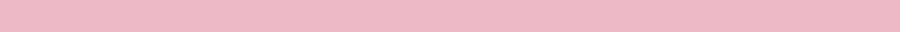
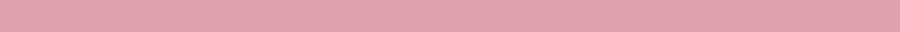

<p align="center">
  
</p>

# Shape CLI

Shape is a command‑line tool that generates solid colour PNG images with support for 13 different geometric shapes.

<p align="center">
  
</p>

## Features

- **13 Shapes Supported** – rectangle, triangle, circle, oval, star, heart, diamond, pentagon, hexagon, octagon, cross, arrow, donut
- **Intelligent Shape Matching** – Fuzzy matching for shape names (e.g., "circl" → "circle")
- **Backward Compatible** – Legacy format `shape WIDTH HEIGHT COLOR` still works
- **Smart Color Processing** – Supports color normalization with typo correction
- **Dimension Validation** – Shape-specific minimum sizes and aspect ratio recommendations
- **High Performance** – Optimized geometric algorithms for fast shape generation
- **Written in TypeScript** using **Bun** runtime
- **Comprehensive Testing** – Unit tests, geometry tests, and performance benchmarks

<p align="center">
  
</p>

## Quick Start

```bash
# Generate a blue circle
bunx @iamkaf/shape circle 100 100 blue

# Generate a red star with 6 points
bunx @iamkaf/shape star 150 150 "#ff0000"

# Generate a green arrow pointing up
bunx @iamkaf/shape arrow 120 80 green
```

<p align="center">
  
</p>

## Usage

### New Format (Recommended)
```bash
bunx @iamkaf/shape <SHAPE> <WIDTH> <HEIGHT> <COLOR> [outputFilename] [options]
```

### Legacy Format (Deprecated)
```bash
bunx @iamkaf/shape <WIDTH> <HEIGHT> <COLOR> [outputFilename] [options]
```

### Options
- `--output <file>` – Custom output filename
- `--force` – Overwrite existing files
- `--verbose` – Detailed output
- `--strict-color` – Disable color normalization
- `--strict-shape` – Disable shape name fuzzy matching

<p align="center">
  
</p>

## Supported Shapes

### Basic Shapes

#### Rectangle
```bash
bunx @iamkaf/shape rectangle 200 100 "#3498db"
```
- **Description**: Filled rectangle covering entire canvas
- **Optimal Dimensions**: Any aspect ratio
- **Output**: `rectangle_200x100.png`

#### Circle
```bash
bunx @iamkaf/shape circle 150 150 "rgb(231, 76, 60)"
```
- **Description**: Perfect circle
- **Optimal Dimensions**: Square (1:1 ratio)
- **Output**: `circle_150x150.png`

#### Triangle
```bash
bunx @iamkaf/shape triangle 120 120 "hsl(120, 100%, 50%)"
```
- **Description**: Equilateral triangle pointing upward
- **Optimal Dimensions**: Square (1:1 ratio)
- **Output**: `triangle_120x120.png`

#### Oval
```bash
bunx @iamkaf/shape oval 180 100 "mediumorchid"
```
- **Description**: Ellipse fitting width and height
- **Optimal Dimensions**: Any aspect ratio
- **Output**: `oval_180x100.png`

### Geometric Shapes

#### Diamond
```bash
bunx @iamkaf/shape diamond 100 100 "gold"
```
- **Description**: Diamond/rhombus shape
- **Optimal Dimensions**: Square (1:1 ratio)
- **Output**: `diamond_100x100.png`

#### Pentagon
```bash
bunx @iamkaf/shape pentagon 130 130 "#e74c3c"
```
- **Description**: Regular five-sided polygon
- **Optimal Dimensions**: Square (1:1 ratio)
- **Output**: `pentagon_130x130.png`

#### Hexagon
```bash
bunx @iamkaf/shape hexagon 140 140 "teal"
```
- **Description**: Regular six-sided polygon
- **Optimal Dimensions**: Square (1:1 ratio)
- **Output**: `hexagon_140x140.png`

#### Octagon
```bash
bunx @iamkaf/shape octagon 160 160 "coral"
```
- **Description**: Regular eight-sided polygon
- **Optimal Dimensions**: Square (1:1 ratio)
- **Output**: `octagon_160x160.png`

### Special Shapes

#### Star
```bash
bunx @iamkaf/shape star 150 150 "yellow"
```
- **Description**: Five-pointed star (customizable)
- **Optimal Dimensions**: Square (1:1 ratio)
- **Special Options**: Number of points (3-16)
- **Output**: `star_150x150.png`

#### Heart
```bash
bunx @iamkaf/shape heart 140 140 "hotpink"
```
- **Description**: Heart shape
- **Optimal Dimensions**: Square (1:1 ratio)
- **Output**: `heart_140x140.png`

#### Cross
```bash
bunx @iamkaf/shape cross 120 120 "darkred"
```
- **Description**: Plus/cross shape
- **Optimal Dimensions**: Square (1:1 ratio)
- **Special Options**: Cross thickness
- **Output**: `cross_120x120.png`

#### Arrow
```bash
bunx @iamkaf/shape arrow 180 120 "steelblue"
```
- **Description**: Arrow pointing right (customizable)
- **Optimal Dimensions**: 1.5:1 (width:height)
- **Special Options**: Direction (up, down, left, right)
- **Output**: `arrow_180x120.png`

#### Donut
```bash
bunx @iamkaf/shape donut 150 150 "chocolate"
```
- **Description**: Ring/donut shape
- **Optimal Dimensions**: Square (1:1 ratio)
- **Special Options**: Ring thickness (0-1)
- **Output**: `donut_150x150.png`

<p align="center">
  
</p>

## Advanced Examples

### Fuzzy Shape Matching
```bash
# These all work thanks to fuzzy matching
bunx @iamkaf/shape circl 100 100 blue        # → circle
bunx @iamkaf/shape tri 100 100 red           # → triangle
bunx @iamkaf/shape heartt 100 100 pink       # → heart
bunx @iamkaf/shape reactangle 200 100 green  # → rectangle
```

### Color Normalization
```bash
# All of these work
bunx @iamkaf/shape circle 100 100 "red"         # Named color
bunx @iamkaf/shape circle 100 100 "#ff0000"     # Hex
bunx @iamkaf/shape circle 100 100 "0xff0000"    # Hex with 0x prefix
bunx @iamkaf/shape circle 100 100 "@red"        # @ prefix
bunx @iamkaf/shape circle 100 100 "rgb(255,0,0)" # RGB
bunx @iamkaf/shape circle 100 100 "bleu"        # Typo correction → blue
```

### Shape-Specific Features
```bash
# Star with 8 points (not yet implemented in CLI, but supported in library)
bunx @iamkaf/shape star 150 150 gold

# Arrow pointing up (not yet implemented in CLI, but supported in library)
bunx @iamkaf/shape arrow 100 150 purple

# Thin donut (not yet implemented in CLI, but supported in library)
bunx @iamkaf/shape donut 150 150 brown
```

### Batch Generation
```bash
# Generate multiple shapes
bunx @iamkaf/shape circle 100 100 red --output "red-circle.png"
bunx @iamkaf/shape triangle 100 100 green --output "green-triangle.png"
bunx @iamkaf/shape star 100 100 blue --output "blue-star.png"
```

### Verbose Mode
```bash
bunx @iamkaf/shape circle 100 100 blue --verbose
# Output: Generating circle 100x100 PNG with color #0000ff
# Output: Output: circle_100x100.png
# Output: ✅ Created circle_100x100.png (15ms)
```

<p align="center">
  
</p>

## Development

This project uses Bun and TypeScript. Install dependencies with:

```bash
bun install
```

### Development Workflow

#### Running the CLI During Development

```bash
# Run with Bun directly
bun src/index.ts rectangle 100 100 red

# Test new shapes
bun src/index.ts circle 50 50 blue --verbose
bun src/index.ts star 100 100 gold --output my-star.png
```

#### Making Changes

1. **Create a feature branch**: `git checkout -b feature/my-improvement`
2. **Make your changes** to the TypeScript files
3. **Run tests**: `bun test` to ensure everything still works
4. **Check code quality**: `bun run lint` and `bun run format`
5. **Test manually**: Use the CLI to verify your changes work
6. **Commit and push**: Follow our contribution guidelines

#### Adding New Shapes

To add a new shape, you need to:
1. Add the shape type to `src/lib/shapes.ts`
2. Implement the geometric logic
3. Add shape constraints and descriptions
4. Write comprehensive tests
5. Update documentation

See [CONTRIBUTING.md](CONTRIBUTING.md) for detailed instructions.

### Testing

Run all tests:
```bash
bun test
```

Run specific test suites:
```bash
bun test tests/unit/shapes.test.ts      # Shape generation tests
bun test tests/unit/geometry.test.ts    # Geometry algorithm tests
bun test tests/benchmark.test.ts        # Performance benchmarks
bun test tests/cli/                     # CLI smoke tests
bun test tests/integration/             # End-to-end tests
```

### Code Quality

Formatting and linting are handled by Biome and Ultracite:

```bash
bun run format  # Format code automatically
bun run lint    # Check code quality and style
```

### Performance Benchmarking

Run performance benchmarks:
```bash
bun test tests/benchmark.test.ts
```

This will output performance metrics for:
- Small shapes (50x50) - targeting <100ms
- Medium shapes (200x200) - targeting <500ms
- Large shapes (500x500) - targeting <1000ms
- Shape options (star points, arrow directions, donut thickness)
- Memory usage and scaling performance

#### Performance Targets

- **Small shapes (50x50)**: < 100ms average
- **Medium shapes (200x200)**: < 500ms average
- **Large shapes (500x500)**: < 1000ms average
- **Memory usage**: ~4 bytes per pixel plus overhead
- **Scaling**: Sub-linear performance scaling

### Project Structure

```
shape/
├── src/
│   ├── index.ts              # Main CLI entry point
│   └── lib/
│       ├── color.ts          # Color validation and normalization
│       ├── dimensions.ts     # Dimension validation
│       ├── file.ts           # File operations and atomic writes
│       ├── geometry.ts       # Geometric helper functions
│       ├── shapes.ts         # Shape generation engine
│       └── shapeValidation.ts # Shape name validation
├── tests/                    # Comprehensive test suite
├── docs/                     # Documentation and assets
└── CONTRIBUTING.md          # Contribution guidelines
```

### Contributing

We welcome contributions! Please read our [CONTRIBUTING.md](CONTRIBUTING.md) guide for:
- Development setup instructions
- Code style guidelines
- Testing requirements
- Pull request process
- Performance considerations

<p align="center">
  
</p>

## Roadmap

### Next Features
- [ ] Outline shapes (`--outline` flag)
- [ ] Configurable thickness (`--thickness` option)
- [ ] Gradient fills
- [ ] Shape rotation

## Project Goals

See [PRD.md](PRD.md) for the full product requirements document.

## License

This project is licensed under the MIT License.

<p align="center">
  
</p>